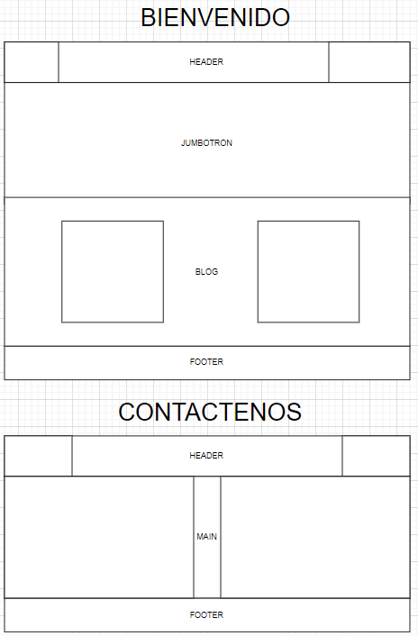

## PROYECTO PÁGINA WEB PARA UNA PROFESIONAL EN ESTÉTICA
### Doctora Fabiola Rodríguez Aráque

La página cuenta con dos archivos conectados:
- Bienvenida
- Contáctenos

Se puede encontrar en la página los siguientes elementos:
1. Menu con flex.
2. Section con grid.
3. Responsive en 600px.
4. Botones.
5. Opción de registro de usuario.

El Prototipo utilizado para el diseño se desarrolló en draw.io:

